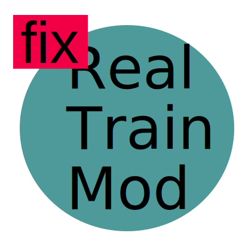
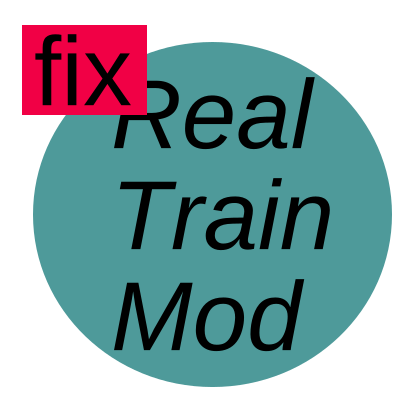
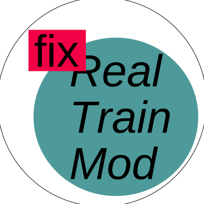

# fixRTM artworks

fixRTM logo and other artworks.

## fixRTM logo

fixRTM logo uses liberation-fonts because it's open source.
But many platform doesn't have liberation by default so in
human-readable editable svg, Arial, a metric compatible font, 
is also specified as fallback.

Human-readable, with text element.
Your browser may show text in incorrect fonts.

Rendered text via [svg-text-to-path]. This is formal logo.

minified version

The logo in circle.

minified version

[svg-text-to-path]: https://github.com/paulzi/svg-text-to-path
